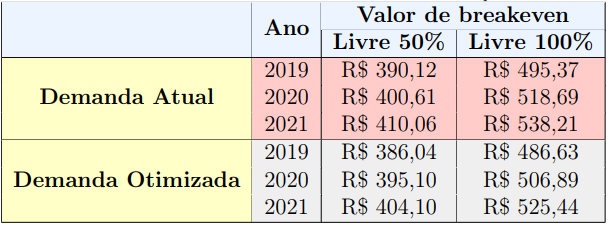
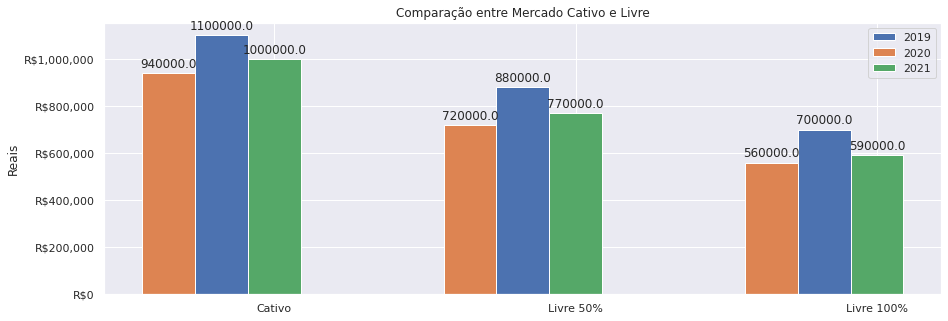
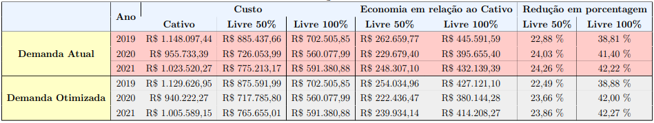

# Estudo de migração para o mercado livre de energia com base na UFCA
## IT304S - Contratação de Energia para Grandes Consumidores
### Estudante: Byron Alejandro Acuña Acurio, R.A: 209428
### Estudante: Diana Estefanía Chérrez Barragán, R.A: 227041
### Estudante: Elson Yoiti Sakô, R.A: 148482
### Estudante: João Lucas de Souza Silva, R.A: 211497
### Estudante: Micaella Aynoã Loiola Ferreira, R.A: 265574
### Estudante: Bruno Furtado Albuquerque, R.A: 214574
### Professor: Dr. Luiz Carlos Pereira da Silva
### Professor: MSc. Lia Farias

Esse repositório faz parte do projeto de estudo de migração do mercado cativo ao livre com base na UFCA. Além do repositório, o relatório completo pode ser encontrado no formato PDF no link https://drive.google.com/file/d/1JkrBhZuN5NFp3CdZ3O2Z6Hk2lqpT2g6Q/view?usp=sharing. Os dados utilizados para o relatório inicial e final estão compilados no código principal final UFCA.ipynb. 

A estrutura geral deste repositório é apresentada a seguir. 

~~~
├── README.md          <- apresentação do projeto
│
├── data
│   ├── external       <- dados de terceiros
│   ├── interim        <- dados intermediários, e.g., resultado de transformação
│   ├── processed      <- dados finais usados para a modelagem
│   └── raw            <- dados originais sem modificações
│
├── notebooks          <- Jupyter notebooks ou equivalentes
│
├── src                <- fonte em linguagem de programação ou sistema (e.g., Orange)
│   └── README.md      <- instruções básicas de instalação/execução
│
└── assets             <- mídias usadas no projeto
~~~

## `data`

Os dados utilizados no projeto foram repassados na disciplina de IT304S - Contratação de Energia para Grandes Consumidores contendo faturas de energia de quatro unidades consumidoras (UC's) da Universidade Federal do Cariri (UFCA). Os dados foram digitalizados no Excel e colocados na pasta da disciplina compartilhada no Google Drive, e posteriomente, foram adicionados no GitHub e processados no ambiente Colab. Foi utilizado um metódo de previsão linear utilizando os dados passados de cada variável para preencher lacunas vazias de modo a permitir a análise, ou acrescentado o valor zero, dependendo do tipo de dado.

## `notebooks`

O código do projeto pode ser obtido no arquivo UFCA.ipynb.

## `src`

O código utilizado na análise é python feito no ambiente Colab.

## `assets`

Relatório Completo: https://drive.google.com/file/d/1JkrBhZuN5NFp3CdZ3O2Z6Hk2lqpT2g6Q/view?usp=sharing

Relatório de Pré-Análise: https://drive.google.com/file/d/1cXDALDNj6ns98IG6yXJtxtKCCosYpYP8/view?usp=sharing

Vídeo de apresentação do Projeto: https:/www.youtube.com

# Projeto `<Estudo de migração para o mercado livre de energia com base na UFCA>`
# Project `<Study of migration to the free energy market based on UFCA>`

# Descrição Resumida do Projeto

Nos últimos anos no Brasil tem crescido o número de consumidores que migram para o mercado livre de energia. Nessa perspectiva, as universidades brasileiras também podem ter grande potencial para migração e gerar economia aos cofres públicos. Neste ensejo, o presente trabalho escolheu a Universidade Federal do Cariri (UFCA) para realização da análise de migração para o mercado livre. Nesse documento, serão apresentadas as análises realizadas para migração do mercado cativo para o livre. A análise foi feita utilizando os dados examinados anteriormente da UFCA, definido a demanda ótima, aspectos jurídicos, observação do SWOT (\textit{strengths, weaknesses, opportunities, threats} - no português, forças, fraquezas, oportunidades e ameaças), e análise econômica do processo de migração. Como resultado, a UFCA precisa entrar como consumidor especial diante dos números de demanda para cada UC, considerando um contrato com comunhão de cargas por comunhão de direito. Os resultados apontam uma economia na fatura anual que pode chegar a 24,26% (livre 50%) e  42,22% (livre 100%) na demanda atual; e na demanda otimizada, 23,86% (livre 50%) e  42,27% (livre 100%). Em reais, a maior economia seria de R$ 262.659,77  (livre 50%) e R$ 445.591,59 (livre 100%) na demanda atual; e na demanda otimizada, R$ 254.034,96 (livre 50%) e  R$ 427.121,10 (livre 100%). Na demanda otimizada, o valor de economia é reduzido, pois a fatura do cativo utilizada na comparação também é reduzida. Logo, ajustar a demanda seria interessante para uma fatura menor no cativo ou livre. No geral, observou-se como funciona o processo de migração ao mercado livre e como utilizar ferramentas para realizar as análises.

# Abstract in English

In recent years in Brazil, the number of consumers who migrate to the free energy market has grown. In this perspective, Brazilian universities may also have great potential for migration and generate savings in public coffers. In this opportunity, the present work chose the Federal University of Cariri (UFCA) to analyze migration to the free market. In this document, the analyzes performed for migration from the captive to the free market will be presented. The analysis was made using the previously examined data from UFCA, defining the optimal demand, legal aspects, observation of SWOT (strengths, weaknesses, opportunities, threats), and economic analysis of the process of migration. As a result, UFCA needs to enter as a special consumer because of the demand figures for each UC, considering a contract with cargo sharing by right sharing. The results point to savings in the annual bill that can reach 24.26% (free 50%) and 42.22% (free 100%) in current demand; and in optimized demand, 23.86% (free 50%) and 42.27% (free 100%). In reais, the biggest savings would be R$ 262,659.77 (50% free) and R$ 445,591.59 (100% free) in current demand; and in optimized demand, R$ 254,034.96 (50% free) and R$ 427,121.10 (100% free). In the optimized demand, the savings value is reduced since the captive invoice used in the comparison is also reduced. Therefore, adjusting the demand would be interesting for a smaller invoice in captive or free. In general, it was observed how the migration process to the free market works and how to use tools to carry out the analyzes.

# Equipe
`<Estudante: Byron Alejandro Acuña Acurio - R.A: 209428>`
`<Estudante: Diana Estefanía Chérrez Barragán - R.A: 227041>`
`<Estudante: Elson Yoiti Sakô - R.A: 148482>`
`<Estudante: João Lucas de Souza Silva - R.A: 211497>`
`<Estudante: Micaella Aynoã Loiola Ferreira - R.A: 265574>`
`<Estudante: Bruno Furtado Albuquerque - R.A: 214574>`

# Vídeo do Projeto
`<coloque um link para o vídeo apresentado o projeto.>`

# Introdução e Motivação

Nos últimos anos o setor elétrico brasileiro vem se reformulando, principalmente com o crescimento no número de fontes renováveis de energia. Em paralelo, o monopólio das distribuidoras e transmissoras possibilitou altos custos que refletiram na economia como um todo [1]. Tudo isso, criou um cenário favorável para o crescimento recente do mercado livre de energia.

O mercado livre de energia propiciou a comercialização de energia elétrica com a negociação de produtores e consumidores de energia. Incluindo benefícios na venda de energia de origem renovável. Assim, o ambiente de contratação livre (ACL) tornou-se um opção ao mercado cativo.

Os benefícios de conseguir negociar o próprio contrato de energia são inúmeros. O primeiro é criar um ambiente competitivo reduzindo custos, gerando novos produtos e serviços, descentralizando as decisões e limitando poder de intervenção estatal [2].

Entretanto, analisar contratos e fundamentos técnicos para migração são necessários, já que um contrato errado pode trazer prejuízos por longos anos. Assim, nesse trabalho o objetivo foi analisar a viabilidade da migração para o mercado livre da Universidade Federal do Cariri (UFCA). Além disso, a proposta da disciplina IT304S - Contratação de Energia para Grandes Consumidores, permitiu conhecer ferramentas e se aprofundar no conteúdo sobre mercado livre. Os resultados foram favoráveis a migração das quatro unidades consumidoras da UFCA em comunhão de carga. O relatório completo do projeto é visto em: https://drive.google.com/file/d/1JkrBhZuN5NFp3CdZ3O2Z6Hk2lqpT2g6Q/view?usp=sharing.

Para tanto, no PDF relatório completo do trabalho apresentou-se na seção III a descrição da universidade escolhida; na seção IV foi apresentado um conteúdo teórico sobre mercado livre e processo de migração, com vantagens e desvantagens; seção V otimização da demanda; na seção VI foi realizado a análise SWOT (strengths, weaknesses, opportunities, threats - no português, forças, fraquezas, oportunidades e ameaças); seção VII comentou-se os aspectos jurídicos; seção VIII analisou a migração para o mercado livre com vies econômico; e finalizando com as considerações finais. No presente GitHub, é apresentado a seguir as perguntas de pesquisa, objetivos do projeto, recursos e metódos utilizados, evolução do projeto, resultados e discussão e as conclusões.

## Perguntas de Pesquisa

Vale a pena migrar para o Mercado Livre? Como consumidor livre ou especial? Qual é a economia estimada? Qual é o preço da energia a partir de quando compensa a migração? Qual a recomendação para uma contratação?

## Objetivos do projeto

O principal objetivo do trabalho foi avaliar a possível migração do mercado cativo ao mercado livre da Universidade Federal do Cariri (UFCA).

Os objetivos específicos são:
  - Definir premissas para o processo de contrato da UFCA;
  - Estudar o conceito e etapas do mercado livre de energia;
  - Estudar a demanda ótima para UFCA;
  - Verificar o SWOT para mercado livre de uma autarquia estatal;
  - Apresentar aspectos jurídicos do processo de migração para o mercado livre de uma universidade;
  - Avaliar a viabilidade e econômica com a migração ao mercado livre de energia.>

# Recursos e Métodos

## Bases de Dados
`A base de dados utilizada foram as contas de energia das quatro UC's repassadas na disciplina de IT304S - Contratação de Energia para Grandes Consumidores, digitalizadas no Excel disponibilizado no Google Drive do curso e tratamento em UFCA.ipynb.

## Ferramentas

Microsoft Excel | https://office.live.com/start/Excel.aspx?ui=pt-BR | `<Editor de planilhas de dados Excel, utilizado para digitalização inicial dos dados de conta de energia das UC's.>`

Colab | https://colab.research.google.com/ | `<Elaboração do código em Python para tratamento dos dados, análises, e avaliação econômica.>`

# Metodologia

O primeiro passo para estudo de migração ao mercado livre foi realizado no primeiro relatório da disciplina IT304S - Contratação de Energia para Grandes Consumidores (disponibilizado no Google Drive do curso, pasta UFCA, ou https://drive.google.com/file/d/1cXDALDNj6ns98IG6yXJtxtKCCosYpYP8/view?usp=sharing), em que foi analisado as contas da UFCA, observando aspectos como uso da demanda e valores de reativos. Bem como, observou-se o comportamento dos dados. Pode-se dizer a metodologia utilizou-se de pesquisas qualitativas e quantitativas.

Nesse GitHub, é apontado o código em Python para analisar a viabilidade de migração do mercado cativo ao mercado livre da UFCA. A primeira parte do trabalho nessa etapa foi estudar o mercado livre, verificando as possibilidades de migração para uma universidade pública como a UFCA, baseado no perfil traçado anteriormente no primeiro relatório. Os resultados e teória foi disponibilizado no relatório final completo em: https://drive.google.com/file/d/1JkrBhZuN5NFp3CdZ3O2Z6Hk2lqpT2g6Q/view?usp=sharing

Posteriormente, foi realizado um processo para otimização de demanda, variando o valor de demanda contratada até chegar ao valor ótimo. Em seguida, aspectos de SWOT e jurídicos foram comentados no relatório completo, já que muito se tem discutido sobre a legalidade e fundamentação da migração do mercado cativo ao livre de universidades públicas. Mesmo já existindo exemplos de sucesso como a UNICAMP.

Por fim, uma análise foi realizada para o processo de migração ao mercado livre. Os dados da UFCA faltantes foram preenchidos com previsão de dados utilizando a plataforma Google Colab [3] em Python, e os valores da conta de energia no cenário de demanda atual e demanda ótima foram obtidos para o mercado cativo e livre, verificando se o processo de migração compensa.

## Detalhamento do Projeto

Os detalhes completo do projeto podem ser visualizados no relatório final em . Devido o formato da estrutura do README foi optado por disponibilizar um PDF para facilitar a leitura e apresentar um resumo nessa página, além do código completo. 

### Etapas para migração para o mercado livre

Diante destes conceitos e análises de riscos, faz-se necessário delinear quais são os passos que a Universidade Federal do Cariri deverá seguir para adentrar ao Mercado Livre. 

- Atendimento ao Pré-Requisito de Demanda Contratada: Como previamente mencionado, a Universidade possui uma demanda contratada de todas as suas unidades consumidoras equivalente a X MW, o que a determina ser um Cliente Especial. Por esta razão, ela terá certas limitações, como atendimento mínimo em média tensão e compra voltada apenas a fontes incentivadas, como a eólica, solar, pch ou biomassa. Como todas as unidades são atendidas na média tensão, não há entraves iniciais para o processo.

- Renúncia de Contrato com a Distribuidora Local: Antes de migrar para o mercado livre, as unidades consumidoras em questão devem realizar a rescisão do contrato com a distribuidora responsável pelos respectivos fornecimentos de energia. Usualmente após a rescisão do contrato com a distribuidora, é necessário aguardar a vigência de 12 meses para que a desvinculação com o mercado cativo seja efetuado em definitivo. 

- Adequação do Sistema de Medição e Faturamento: Para se tornar um adepto à CCEE, é necessário solicitar a alteração do método de medição de energia, visando a coleta de dados que serão alimentados no Sistema de Coleta de Dados de Energia (SCDE).

- Modelagem de Ativos: Para que o agente possa efetuas as operações na CCEE, é necessário que, através de uma representação contábil, seja apresentada a modelagem dos ativos ao sistema de contabilização e liquidação. Vale salientar, que para o caso da UFCA, será necessário englobar os ativos de todos os campus. 

- Abertura de Conta Corrente Específica: Visando a liquidação financeira, o  agente deverá abrir uma conta corrente no mesmo CNPJ matriz das unidades consumidoras, como é o caso da UFCA na qual fará uma comunhão de cargas. Esta conta deverá ser aberta na instituição financeira Banco Bradesco S/A, situada na Avenida Paulista, da cidade de São Paulo/SP.

- Adesão Aprovada pelo Conselho de Administração: Findados os procedimentos supracitados pelo Conselho de Administração, o agente está apto a adentrar ao mercado livre.

### Procedimentos e detalhes do mercado livre para UFCA

Os procedimentos para análise de viabilidade do processo de migração de energia elétrica para o mercado livre tem como objetivo final verificar a economia proporcionada por diferentes cenários de migração. Os procedimentos foram esboçados com base na análise de trabalhos da literatura [4,5,6] e implementado partes no GitHub do projeto e/ou Excel para chegar em uma conclusão sobre a migração ao mercado livre de energia da UFCA.

- Procedimento 1: Foi realizado o levantamento das contas de energia disponíveis para as 4 UC's da UFCA e digitalizadas no Colab;
- Procedimento 2: Dados faltantes foram incrementados utilizando uma algoritmo de previsão de dados;
- Procedimento 3: Foi observado o comportamento dos dados, perfil do cliente, tipo de contrato, demanda e ultrapassagem de reativo;
- Procedimento 4: Foi sugerido alterações na demanda com um estudo de otimização de demanda em tabela elaborada no Excel;
- Procedimento 5: Levantou-se os custos de energia dos dois últimos anos (2019, e 2020), e aplicou-se algoritmo de previsão para o ano seguinte (2021);
- Procedimento 6: Foi separado (calculado) o custo com TUSD (Tarifa de Uso do Sistema de Distribuição) e TE (Tarifa de Energia) para posterior cálculo da conta no mercado livre;
- Procedimento 7: Foi estudado a análise por SWOT e jurídica para caso de autarquias estatais;
- Procedimento 8: Foi definido o perfil de contrato para o mercado livre de energia compatível com UFCA;
- Procedimento 9: Foi calculada a conta para o mercado livre considerando consumidor especial com 50% e 100% de desconto para fontes incentivadas, e os anos de 2019, 2020, 2021;
- Procedimento 10: Análise dos resultados obtidos para contas no cativo e livre.

É importante destacar que algumas premissas foram consideradas. Considerou-se que na UFCA as curvas futuras de consumo seguem o comportamento/sazonalidade das curvas passadas, aplicando algoritmos de previsão de futura, ou seja, considera-se que não serão implementadas nenhuma carga muito maior do que já existia; a tarifa horosazonal verde é a melhor opção para o cativo, já que é uma universidade nova, e possivelmente foram realizada análises; a migração ao mercado livre irá considerar as 4 UC's em conjunto, já que a maioria tem uma demanda pequena em comparação aos limites necessários para migração, e isso seria bom para o futuro e gestão de energia da universidade como um todo.

Diante dos dados analisados para UFCA foi considerado que o consumidor seria do tipo especial (necessidade de contratar energia incentivada), com modulação de vigência única (flat), pois é o tipo mais comum considerado nas análises de migração para o mercado livre. 

## Evolução do Projeto

A evolução do projeto e procedimentos também são detalhados no relatório completo em .

A maior dificuldade encontrada foi o tempo para aprendizado das ferramentas (programação Python, Colab, e GitHub) e mercado livre de energia. Como o processo de migração é algo de tem um custo alto para consultoria, várias são as estratégias adotadas e a maioria não é comentada na literatura. Entretanto, a análise foi efetuada com sucesso, deixando espaço para trabalhos futuros. As outras possíveis análises são discutidas nos trabalhos futuros.

# Resultados e Discussão
Os resultados obtidos foi com base na análise econômica. Para realizar a análise econômica foi considerado o cenário com a demanda atual (1049 kW para UC's juntas) e o cenário com a demanda otimizada (750 kW para UC's juntas). Além disso, calculou-se o incentivo de 50% que seria o mínimo e o de 100% que seria o máximo, já que a fonte utilizada é incentivada.

O primeiro objetivo na análise foi obter o breakeven (ponto de equilíbrio) [6], de modo que a conta do mercado livre tivesse o mesmo custo da conta do mercado cativo. O breakeven é um método bastante conhecido, e pode ser utilizado para tomar a decisão estabelecendo um valor limite. O custo de migração ao mercado livre irá compensar caso o valor seja inferior ao breakeven. Entretanto, é válido destacar que como existe riscos no mercado livre e custos de adequação, deve-se estabelecer uma margem de segurança inferior ao breakeven. Logo, o breakeven serve como um parâmetro referência para o começo da análise, mostrando a partir de qual ponto pode-se começar a investir no mercado livre.

A Tabela 1 apresentou o valor do breakeven obtido para cada cenário. No caso da demanda atual, sendo conservador, o menor valor que poderia ser comprada de energia no mercado livre por MWh seria R$ 390,12 para o livre 50% e R$495,37 para o livre 100%. No caso da demanda ótima, seria R$ 386,04 para o livre 50% e R$486,63 para o livre 100%. Um detalhe a ser comentado, é que as fontes livre 100% as vezes podem ter um custo maior que a 50% no leilão, pois tem uma demanda maior no leilão. Assim, é necessário sempre realizar as devidas análises após um leilão.

Tabela 1. Valores de breakeven em diferentes cenários analisados para o MWh
<h1 align="center">  </h1>

Posteriormente, foi verificado o custo total da conta no cativo e no livre. Para o mercado livre considerou-se um valor de R$ 240,00/MWh, conforme utilizado na literatura encontrada [5]. Entretanto, esse valor pode sofrer grandes alterações para mais ou para menos dependendo do leilão. O valor de R$ 240,00/MWh foi considerado para o cenário 50% e 100%, é um valor que pode ser atingido na prática e serve para realização do estudo na disciplina, buscando uma estimativa de custo total. A Figura 1 mostra o cenário com a demanda atual, e a Figura 2 com a demanda otimizada, o valor no gráfico é a faixa aproximada do custo. É interessante destacar que o ano de 2021, é baseado em anos anteriores. Os dados de 2020 obtidos só tiveram alguns meses de pandemia contabilizados, o restante foi previsão baseada nos anos anteriores, devido a pandemia do COVID-19 e dados disponíveis.  Em todos os cenários verifica-se que o livre tem economia em relação ao cativo.

<h1 align="center">  </h1>
Figura 1. Custos de Fatura anual para Cativo e Livre nos anos analisados com demanda atual

<h1 align="center">  </h1>
Figura 2. Custos de Fatura anual para Cativo e Livre nos anos analisados com demanda otimizada

Para verificar em valores a diferença de custo das faturas foi adicionada na Tabela 2. A economia é calculada pela diferença do preço do cativo e livre. Na demanda otimizada, a fatura do cativo é menor, logo a economia com o mercado livre também é um pouco menor considerando a diferença de preço. Mas, a fatura total ela é reduzida. Dessa forma, com a alteração de demanda tem-se uma fatura com valor inferior a fatura com a demanda atual. Pode ser observado que a economia na fatura anual pode chegar a 24,26% (livre 50%) e  42,22% (livre 100%) na demanda atual; e na demanda otimizada, 23,86% (livre 50%) e 42,27% (livre 100%). Logo, na demanda otimizada o valor pago da fatura é um pouco menor em todos os caso, do que na demanda atual.

Com todos os resultados, pode-se dizer que a migração para o mercado livre é viável para UFCA nos valores considerado no trabalho. Pode-se observar que o valor de breakeven é muito maior do que o praticado geralmente no mercado livre. Logo, o mercado livre pode ser um alternativa atrativa para UFCA.

Tabela 2. Custo de faturas e diferenças em diferentes cenários analisados
<h1 align="center">  </h1>

Para mais, o custo de adequação de cada UC pode chegar ao valor de R$ 50.000,00 reais, conforme [7]. Esse valor foi o único encontrado na literatura para referência, bem como não se sabe qual a necessidade de alteração para possibilitar medição na UFCA. Considerando o valor de R$ 50.000,00 reais para cada UC, tem-se um investimento de R$ 200.000,00 reais para o primeiro ano. O ganho obtido pela diferença em relação a fatura do cativo, paga o investimento com um payback (tempo de retorno) menor que 10 meses para livre 50% e aproximadamente 6 meses para o livre 100%, dependendo do ano considerado.

Assim, a recomendação para UFCA é a migração ao mercado livre em comunhão de carga, com monitoramento mensal do consumo, refazendo a avaliação de custos com base no valor contratado em leilão, desde que o custo da adequação seja pago em tempo inferior ao contrato. Logo, deve-se sempre negociar no leilão de modo a tentar obter valores próximos ou inferior ao custo de referência apresentado no estudo, o que é possível pelo que tem sido visto nos últimos leilões.

# Conclusões
O presente trabalho teve como objetivo avaliar a possível migração do mercado cativo ao mercado livre da Universidade Federal do Cariri (UFCA). Os estudo iniciais possibilitaram entender diferentes tipos de faturas de energia elétrica, e pontos que devem ser considerados no processo de migração ao mercado livre. Notou-se o quanto é importante ter alternativas como mercado livre, pois isso possibilita a comercialização de energia entre produtos e consumidores, podendo economizar custo e ter um controle melhor sobre os gastos com energia elétrica. Além disso, foi necessário aprofundar os conhecimentos em ferramentas não conhecidas para integrantes do grupo, como GitHub, e Colab.

Como resultado, a UFCA precisa entrar como consumidor especial diante dos números de demanda para cada UC, considerando um contrato com comunhão de cargas por comunhão de direito. Os resultados apontam uma economia na fatura anual que pode chegar a 24,26% (livre 50%) e  42,22% (livre 100%) na demanda atual; e na demanda otimizada, 23,86% (livre 50%) e  42,27% (livre 100%). Em reais, a maior economia seria de R$ 262.659,77  (livre 50%) e R$ 445.591,59 (livre 100%) na demanda atual; e na demanda otimizada, R$ 254.034,96 (livre 50%) e  R$ 427.121,10 (livre 100%). Lembrando, que na demanda otimizada, o valor de economia é reduzido, pois a fatura no cativo utilizada na comparação também é reduzida. Logo, ajustar a demanda seria interessante para uma fatura menor no cativo ou livre.

Logo, a migração é viável na demanda atual para um custo de energia de R$ 390,12 para o livre 50% e R$495,37 para o livre 100%. No caso da demanda ótima, seria R$ 386,04 para o livre 50% e R$486,63 para o livre 100%.

# Trabalhos Futuros
Com todos os estudos realizados e materiais observados pode-se levantar outras considerações que são interessantes para uma análise de migração ao mercado livre em universidades, elevando o nível de precisão e reduzindo as incertezas. Como por exemplo a avaliação dos equipamentos existentes em cada unidade da UFCA; testes e definição de outros tipos de contratos como sazonalizado; utilizar algoritmos de previsão com base no plano de expansão da UFCA; Análise dos riscos com PLD e ultrapassagem do consumo; analisar outras possíveis alterações na potência reativa diante cargas; considerar outros custos de energia para o mercado livre; e buscar formas de suprimir as ameaças do SWOT.

Para mais, é necessário o monitoramento constante dos dados de cada UC depois do processo de migração de energia para o mercado livre. Assim, consegue-se obter um controle e possibilita realizar alterações no contrato para obter maior economia.

# Referências

[1] J. K. F. de Lima, “Um estudo sobre a instabilidade causada no ambiente de livre
contratação de energia elétrica devido a erros no processo de formação do preço
de liquidação das diferenças,” 2019, universidade Federal do Ceará, Trabalho de
conclusão de curso em Engenharia Elétrica, Fortaleza, Brasil.

[2] Abraceel, “Benefícios, riscos e desafios na transição para um mercado livre,” 2021. [Online]. Available: https://www.aneel.gov.br/documents/656877/17755237/Reginaldo+Medeiros.pdf/529c0dc1-4537-2e7c-8d75-273ebfc37fa3

[3] Google, “Ambiente google colab,” 2021. [Online]. Available: https://colab.research.google.com/

[4] F. M. Lourençato, S. C. Campos, A. M. A. de Castro, J. R. de Castro Barbosa do Amaral, N. F. Rossi, A. P. Araki, F. R. F. S. de Paula, A. P. Filho, L. de Faria Rodrigues, and M. S. F. do Amaral Fregonesi, “Estudo de caso da migração de compra de energia elétrica do mercado cativo para o mercado de energia livre por uma autarquia,” Revista Qualidade HC, pp. 1–13, 2018.

[5] R. E. M. da Costa, “Análise e simulação da migração de uma empresa do mercado cativo para o mercado livre de energia elétrica,” 2019, universidade Federal De Uberlândia, Trabalho de conclusão de curso em Engenharia Elétrica, Uberlândia, Brasil.

[6] K. R. do Nascimento, “Migração para o mercado livre de energia e alteração de tarifa horária: estudo de caso em uma indústria,” 2018, universidade Federal do Rio de Janeiro, Trabalho de conclusão de curso em Engenharia, Rio de Janeiro, Brasil.

[7] R. E. M. da Costa, “Sistemas de medição para faturamento e o mercado de energiaelétrica:  uma visão crítica do referencial regulatório,” 2009, universidade de SãoPaulo, Mestre em Engenharia Elétrica, São Paulo, Brasil

